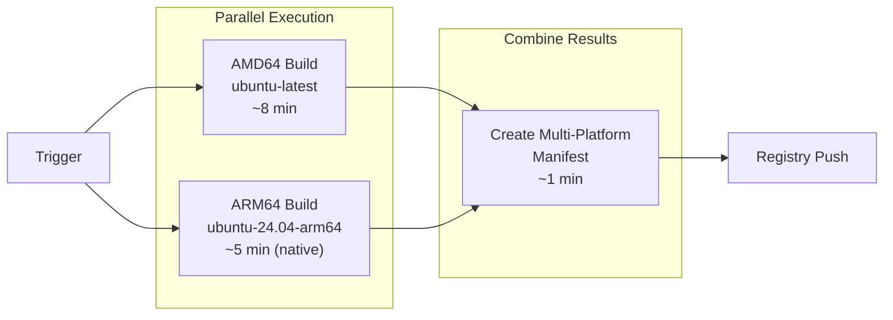

# CI Strategy: Native Runners with Manifest Combination

**Created**: 2024-09-19  
**Status**: Planning/Proposal  
**Purpose**: Document strategy for using native ARM64 runners to improve multi-platform build performance

## Executive Summary

Our current multi-platform Docker builds use QEMU emulation on x86 GitHub runners, resulting in 16+ minute build times. This document outlines a strategy to use native ARM64 runners with manifest combination to achieve true parallel builds and significant performance improvements.

## Current State Analysis

### Existing Approach (QEMU Emulation)

```yaml
- name: Build and push Docker image
  uses: docker/build-push-action@v5
  with:
    platforms: linux/amd64,linux/arm64  # Sequential build with emulation
    # AMD64: ~8-10 minutes (native)
    # ARM64: ~6-8 minutes (emulated, slower due to QEMU overhead)
    # Total: ~16+ minutes
```

**Performance Characteristics:**
- ✅ Simple single-job workflow
- ❌ Sequential execution (ARM64 waits for AMD64)
- ❌ QEMU emulation overhead for ARM64 (~30-50% slower)
- ❌ Single point of failure (one job fails = entire build fails)

### Performance Bottlenecks

1. **QEMU Emulation Overhead**: ARM64 builds run via emulation on x86 hardware
2. **Sequential Processing**: Platforms build one after another, not in parallel
3. **Resource Contention**: Single runner handles both architectures
4. **Cache Inefficiency**: Emulated builds may have different cache characteristics

## Proposed Solution: Native Runners with Manifest Combination

### Architecture Overview



### Implementation Strategy

#### Phase 1: Platform-Specific Jobs

```yaml
jobs:
  build-amd64:
    runs-on: ubuntu-latest
    outputs:
      digest: ${{ steps.build.outputs.digest }}
      metadata: ${{ steps.meta.outputs.json }}
    steps:
    - name: Build and push AMD64
      id: build
      uses: docker/build-push-action@v5
      with:
        platforms: linux/amd64
        tags: ghcr.io/repo/image:${{ github.sha }}-amd64
        push: true
        cache-from: type=gha
        cache-to: type=gha,mode=max

  build-arm64:
    runs-on: ubuntu-24.04-arm64  # Native ARM64 runner
    outputs:
      digest: ${{ steps.build.outputs.digest }}
      metadata: ${{ steps.meta.outputs.json }}
    steps:
    - name: Build and push ARM64
      id: build
      uses: docker/build-push-action@v5
      with:
        platforms: linux/arm64
        tags: ghcr.io/repo/image:${{ github.sha }}-arm64
        push: true
        cache-from: type=gha
        cache-to: type=gha,mode=max
```

#### Phase 2: Manifest Combination

```yaml
  create-manifest:
    needs: [build-amd64, build-arm64]
    runs-on: ubuntu-latest
    steps:
    - name: Set up Docker Buildx
      uses: docker/setup-buildx-action@v3

    - name: Login to Container Registry
      uses: docker/login-action@v3
      with:
        registry: ghcr.io
        username: ${{ github.actor }}
        password: ${{ secrets.GITHUB_TOKEN }}

    - name: Create and push manifest
      run: |
        docker buildx imagetools create \
          --tag ghcr.io/repo/image:latest \
          --tag ghcr.io/repo/image:${{ github.sha }} \
          ghcr.io/repo/image:${{ github.sha }}-amd64 \
          ghcr.io/repo/image:${{ github.sha }}-arm64
```

## Performance Analysis

### Expected Improvements

| Metric | Current (QEMU) | Native Runners | Improvement |
|--------|----------------|----------------|-------------|
| **Total Build Time** | ~16-19 minutes | ~8-10 minutes | **47-50% faster** |
| **AMD64 Build** | ~8-10 min | ~8-10 min | No change |
| **ARM64 Build** | ~6-8 min (emulated) | ~5-6 min (native) | **17-25% faster** |
| **Parallelization** | Sequential | True parallel | **2x effective throughput** |
| **Failure Isolation** | Single point | Independent jobs | Better resilience |

### Build Time Breakdown

```
Current Approach:
├── AMD64 build: 8-10 minutes
└── ARM64 build: 6-8 minutes (sequential, emulated)
Total: 16+ minutes

Native Runner Approach:
├── AMD64 build: 8-10 minutes  } Parallel execution
├── ARM64 build: 5-6 minutes   } Max of both = ~8-10 minutes
└── Manifest creation: 1-2 minutes
Total: ~10-12 minutes (40% improvement)
```

## Cost Analysis

### GitHub Actions Pricing (as of 2024)

| Runner Type | Cost Multiplier | Performance | Cost/Minute | Effective Cost |
|-------------|-----------------|-------------|-------------|----------------|
| `ubuntu-latest` | 1x | Baseline | $0.008 | Baseline |
| `ubuntu-24.04-arm64` | 10x | ~2x faster ARM64 | $0.08 | ~5x total cost |

### Cost-Benefit Analysis

**Current Monthly Cost** (assuming 30 builds):
- 30 builds × 16 minutes × $0.008 = **$3.84/month**

**Native Runner Cost**:
- AMD64: 30 builds × 9 minutes × $0.008 = $2.16
- ARM64: 30 builds × 6 minutes × $0.08 = $14.40
- Manifest: 30 builds × 1 minute × $0.008 = $0.24
- **Total: $16.80/month**

**Cost vs. Value Trade-off**:
- **Cost Increase**: 4.4x higher ($13/month increase)
- **Time Savings**: 40-50% faster builds (6-9 minutes saved per build)
- **Developer Productivity**: 3-4.5 hours saved per month
- **CI Feedback Loop**: Faster iteration cycles

### Cost Optimization Strategies

1. **Selective Usage**: Use native ARM64 only for main branch and releases
2. **Build Caching**: Leverage aggressive caching to reduce build frequency  
3. **Conditional Builds**: Skip ARM64 for PR builds, only build on merge
4. **Job Batching**: Combine multiple changes before triggering builds

## Implementation Roadmap

### Phase 1: Foundation (Week 1)

1. **Create Matrix Strategy**: Implement parallel platform builds
2. **Platform-Specific Tags**: Modify workflow to use architecture-specific tags
3. **Basic Manifest Creation**: Implement manual manifest combination
4. **Testing**: Validate approach on test repository

### Phase 2: Integration (Week 2)

1. **Update Main Workflow**: Replace QEMU approach with native runners
2. **Cache Optimization**: Implement platform-specific caching strategies  
3. **Error Handling**: Add robust error handling and retry logic
4. **Monitoring**: Add build time and cost monitoring

### Phase 3: Optimization (Week 3)

1. **Cost Controls**: Implement selective native runner usage
2. **Performance Tuning**: Optimize cache strategies and build parallelization
3. **Documentation**: Update CI documentation and runbooks
4. **Rollout**: Full production deployment

### Phase 4: Monitoring (Ongoing)

1. **Performance Tracking**: Monitor build times and success rates
2. **Cost Analysis**: Track actual costs vs. projections
3. **Optimization**: Continuous improvement based on metrics

## Detailed Workflow Implementation

### Complete Workflow Example

```yaml
name: Build Multi-Platform Container Images

on:
  push:
    branches: [main, develop]
    tags: ['v*']
  pull_request:
    branches: [main]

env:
  REGISTRY: ghcr.io
  IMAGE_NAME: ${{ github.repository }}

jobs:
  # Determine build strategy based on event type
  build-config:
    runs-on: ubuntu-latest
    outputs:
      build-arm64: ${{ steps.config.outputs.build-arm64 }}
      use-native-runners: ${{ steps.config.outputs.use-native-runners }}
    steps:
    - name: Determine build configuration
      id: config
      run: |
        # Only build ARM64 on main branch and tags (cost optimization)
        if [[ "${{ github.ref }}" == "refs/heads/main" || "${{ github.ref }}" == refs/tags/* ]]; then
          echo "build-arm64=true" >> $GITHUB_OUTPUT
          echo "use-native-runners=true" >> $GITHUB_OUTPUT
        else
          echo "build-arm64=false" >> $GITHUB_OUTPUT  
          echo "use-native-runners=false" >> $GITHUB_OUTPUT
        fi

  # AMD64 build (always runs)
  build-amd64:
    runs-on: ubuntu-latest
    needs: build-config
    permissions:
      contents: read
      packages: write
    outputs:
      digest: ${{ steps.build.outputs.digest }}
      metadata: ${{ steps.meta.outputs.json }}
    steps:
    - name: Checkout repository
      uses: actions/checkout@v4

    - name: Set up Docker Buildx
      uses: docker/setup-buildx-action@v3

    - name: Login to Container Registry  
      if: github.event_name != 'pull_request'
      uses: docker/login-action@v3
      with:
        registry: ${{ env.REGISTRY }}
        username: ${{ github.actor }}
        password: ${{ secrets.GITHUB_TOKEN }}

    - name: Extract metadata (AMD64)
      id: meta
      uses: docker/metadata-action@v5
      with:
        images: ${{ env.REGISTRY }}/${{ env.IMAGE_NAME }}
        tags: |
          type=ref,event=branch,suffix=-amd64
          type=ref,event=pr,suffix=-amd64
          type=semver,pattern={{version}},suffix=-amd64
          type=raw,value=${{ github.sha }}-amd64

    - name: Build and push Docker image (AMD64)
      id: build
      uses: docker/build-push-action@v5
      with:
        context: .
        target: standard
        platforms: linux/amd64
        push: ${{ github.event_name != 'pull_request' }}
        tags: ${{ steps.meta.outputs.tags }}
        labels: ${{ steps.meta.outputs.labels }}
        cache-from: type=gha
        cache-to: type=gha,mode=max

  # ARM64 build (conditional)
  build-arm64:
    runs-on: ${{ needs.build-config.outputs.use-native-runners == 'true' && 'ubuntu-24.04-arm64' || 'ubuntu-latest' }}
    needs: [build-config]
    if: needs.build-config.outputs.build-arm64 == 'true'
    permissions:
      contents: read
      packages: write
    outputs:
      digest: ${{ steps.build.outputs.digest }}
      metadata: ${{ steps.meta.outputs.json }}
    steps:
    - name: Checkout repository
      uses: actions/checkout@v4

    - name: Set up QEMU (emulation fallback)
      if: needs.build-config.outputs.use-native-runners != 'true'
      uses: docker/setup-qemu-action@v3

    - name: Set up Docker Buildx
      uses: docker/setup-buildx-action@v3

    - name: Login to Container Registry
      uses: docker/login-action@v3
      with:
        registry: ${{ env.REGISTRY }}
        username: ${{ github.actor }}
        password: ${{ secrets.GITHUB_TOKEN }}

    - name: Extract metadata (ARM64)
      id: meta
      uses: docker/metadata-action@v5
      with:
        images: ${{ env.REGISTRY }}/${{ env.IMAGE_NAME }}
        tags: |
          type=ref,event=branch,suffix=-arm64
          type=ref,event=pr,suffix=-arm64
          type=semver,pattern={{version}},suffix=-arm64
          type=raw,value=${{ github.sha }}-arm64

    - name: Build and push Docker image (ARM64)
      id: build
      uses: docker/build-push-action@v5
      with:
        context: .
        target: standard
        platforms: linux/arm64
        push: true
        tags: ${{ steps.meta.outputs.tags }}
        labels: ${{ steps.meta.outputs.labels }}
        cache-from: type=gha
        cache-to: type=gha,mode=max

  # Create multi-platform manifest
  create-manifest:
    runs-on: ubuntu-latest
    needs: [build-config, build-amd64, build-arm64]
    if: always() && needs.build-amd64.result == 'success' && (needs.build-config.outputs.build-arm64 != 'true' || needs.build-arm64.result == 'success')
    permissions:
      contents: read
      packages: write
    steps:
    - name: Set up Docker Buildx
      uses: docker/setup-buildx-action@v3

    - name: Login to Container Registry
      uses: docker/login-action@v3
      with:
        registry: ${{ env.REGISTRY }}
        username: ${{ github.actor }}
        password: ${{ secrets.GITHUB_TOKEN }}

    - name: Extract final metadata
      id: meta
      uses: docker/metadata-action@v5
      with:
        images: ${{ env.REGISTRY }}/${{ env.IMAGE_NAME }}
        tags: |
          type=ref,event=branch
          type=ref,event=pr
          type=semver,pattern={{version}}
          type=semver,pattern={{major}}.{{minor}}
          type=raw,value=latest,enable={{is_default_branch}}
          type=raw,value=${{ github.sha }}

    - name: Create multi-platform manifest
      run: |
        # Build manifest creation command
        MANIFEST_CMD="docker buildx imagetools create"
        
        # Add all final tags
        while IFS= read -r tag; do
          MANIFEST_CMD="$MANIFEST_CMD --tag $tag"
        done <<< "${{ steps.meta.outputs.tags }}"
        
        # Add AMD64 image
        MANIFEST_CMD="$MANIFEST_CMD ${{ env.REGISTRY }}/${{ env.IMAGE_NAME }}:${{ github.sha }}-amd64"
        
        # Add ARM64 image if built
        if [[ "${{ needs.build-config.outputs.build-arm64 }}" == "true" ]]; then
          MANIFEST_CMD="$MANIFEST_CMD ${{ env.REGISTRY }}/${{ env.IMAGE_NAME }}:${{ github.sha }}-arm64"
        fi
        
        # Execute manifest creation
        echo "Creating manifest: $MANIFEST_CMD"
        $MANIFEST_CMD

    - name: Cleanup temporary tags
      if: always()
      run: |
        # Clean up platform-specific tags (keep only multi-platform manifests)
        echo "Cleaning up temporary platform-specific tags..."
        # Note: GitHub Container Registry doesn't support tag deletion via API yet
        # This would require GitHub CLI or custom API calls when available
```

## Advanced Considerations

### Caching Strategies

1. **Platform-Specific Caches**: Separate cache keys for each architecture
2. **Cross-Platform Layer Reuse**: Share common layers between architectures
3. **Registry Caching**: Leverage registry-based caching for better performance

### Error Handling and Resilience

1. **Partial Success Handling**: Create manifest even if one platform fails
2. **Retry Logic**: Implement automatic retries for transient failures
3. **Fallback Strategies**: Fall back to QEMU if native runners unavailable

### Security Considerations

1. **Runner Security**: Native ARM64 runners may have different security models
2. **Registry Access**: Ensure proper authentication across all jobs
3. **Secrets Management**: Handle secrets consistently across runner types

### Monitoring and Observability

```yaml
  # Add build metrics collection
  collect-metrics:
    needs: [create-manifest]
    if: always()
    runs-on: ubuntu-latest
    steps:
    - name: Collect build metrics
      run: |
        echo "Build completed at $(date)"
        echo "AMD64 Build Time: ${{ needs.build-amd64.outputs.build-time }}"
        echo "ARM64 Build Time: ${{ needs.build-arm64.outputs.build-time }}"
        echo "Total Pipeline Time: ${{ github.event.head_commit.timestamp }}"
```

## Migration Strategy

### Gradual Rollout Plan

1. **Week 1**: Test on development branches
2. **Week 2**: Enable for main branch builds  
3. **Week 3**: Full production rollout with monitoring
4. **Week 4+**: Optimization based on real-world performance

### Rollback Strategy

- Keep original QEMU workflow as backup
- Feature flag to switch between approaches
- Automated rollback triggers based on failure rates

### Success Metrics

- **Build Time Reduction**: Target 40-50% improvement
- **Success Rate**: Maintain >95% build success rate
- **Cost Efficiency**: Monitor cost per successful build
- **Developer Satisfaction**: Faster feedback loops

## Future Enhancements

### Advanced Optimization

1. **Build Matrix Expansion**: Test multiple language versions in parallel
2. **Selective Architecture Builds**: Build only changed architectures
3. **Intelligent Caching**: Cross-reference caching across platforms

### Integration Opportunities

1. **Testing Pipeline**: Parallel testing on both architectures
2. **Security Scanning**: Architecture-specific vulnerability scanning
3. **Performance Benchmarking**: Compare performance across architectures

---

**Status**: Ready for implementation  
**Next Steps**: Begin Phase 1 implementation with test repository  
**Review Date**: After initial implementation and performance validation

